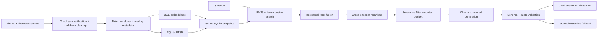

# Architecture and operating boundaries

## Ingestion

The downloader reads a pinned GitHub tree and fetches only English documentation
Markdown, with eight concurrent requests, three attempts per file, a 60-second
network timeout, a 2 MB file cap, and Git blob checksum validation. No arbitrary
URLs or filesystem paths are accepted through the HTTP API. A fetch failure keeps
the previous corpus intact. Frontmatter, Hugo shortcodes, comments, image references,
and link targets are removed; code blocks remain. Very short navigation pages are
excluded. Hugo includes are not rendered, so some source text is incomplete.

The BGE tokenizer produces 220-token windows with 35-token overlap. Offsets preserve
the cleaned source text, while each chunk keeps its page URL, title, and most recent
heading. A chunk can cross a section boundary; this is a transparent baseline rather
than a syntax-aware Markdown splitter. Chunk IDs depend on source, offset, and content.

## Indexing and consistency

Normalized float32 vectors, chunk metadata, and FTS5 live in one SQLite database.
All model work happens before replacing the active index. A build lock prevents
concurrent writers; a complete temporary database is atomically renamed on success.
Rebuilds replace the corpus snapshot, so deleted sources do not leave stale chunks.
Embedding identity and revision are checked before opening an index.

A service process keeps an open database connection and an in-memory vector matrix
from the same snapshot. Rebuilding does not switch a running process to the new
index: restart it explicitly. The SQLite read connection is protected by a lock.
The model's dense vectors are searched exactly, which is straightforward at this
corpus size; ANN or a separate vector database would become useful at larger scale.

## Retrieval

1. BM25 over title, heading, and body retrieves 30 candidates; titles receive more weight.
2. The BGE model embeds the question with its recommended retrieval prefix; normalized
   vectors are compared with cosine similarity for another 30 candidates.
3. Reciprocal-rank fusion combines both rankings using `1 / (60 + rank)`.
4. The top 30 fused chunks are scored jointly with the question by a cross-encoder.
5. Return five chunks by default, with at most two from a single page.

RRF scores and cross-encoder logits are ranking signals, not confidence probabilities.
The default answer filter discards logits below zero. This threshold is a starting
point and is not calibrated on a representative abstention dataset.

## Answers and citations

The context builder budgets passages in BGE-tokenizer units, including an allowance
for metadata. This bounds retrieved text, not the exact prompt tokens of every
Ollama model. Ollama receives up to 8,192 context tokens and a 1,200-token output cap.
Supported local models must handle that context size and structured output.

Generated output is a Pydantic schema of claims and evidence. Each claim must cite an
available chunk with a verbatim quote. Whitespace-only reflow is accepted, then replaced
with the exact original source span; changes to words or punctuation are rejected.
URLs are resolved by the server, never accepted
from generated text. Invalid JSON, missing claims, unknown IDs, and nonmatching quotes
trigger one repair attempt. Network failures and exhausted repair attempts return
explicitly labeled excerpts. A model's deliberate abstention is preserved.

This verifies citation provenance; it does **not** prove that a quote entails a claim.
Prompt instructions are a mitigation, not a complete prompt-injection defense. The
application grants the model no tools, code execution, secrets, or outbound browsing.

## Serving

FastAPI provides an OpenAPI contract, validation, health/readiness endpoints, optional
constant-time API-key checks, and bounded concurrent inference. Saturation returns
503 with `Retry-After`. Model calls run in worker threads. Structured logs include
request ID, mode, fallback, latency, and citation count; prompts and API keys are not logged.

This is a single-node portfolio reference, not an audited multi-tenant service.
Before internet exposure, configure TLS, an API key, request-body limits, request
rate limits, timeouts, and monitoring at a reverse proxy. Caller cancellation may
not stop an already-running inference. Generation can take up to two configured
timeouts when an invalid response needs repair. No automatic cost accounting,
tenant isolation, incremental updates, distributed tracing, or autoscaling is claimed.

## Design references

- [Sentence Transformers retrieve and rerank](https://www.sbert.net/examples/sentence_transformer/applications/retrieve_rerank/README.html)
- [SQLite FTS5 and BM25](https://www.sqlite.org/fts5.html)
- [Ollama structured outputs](https://docs.ollama.com/capabilities/structured-outputs)
- [BGE model card and query instructions](https://huggingface.co/BAAI/bge-small-en-v1.5)
